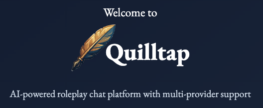

# Quilltap

A self-hosted AI chat platform that puts you in control. Connect to any LLM provider, organize your work into projects, manage files, and chat with AI characters—all while keeping your data private and under your control.

<p align="center">
  
</p>

[](LICENSE)
[](package.json)

## Why Quilltap?

- **Self-hosted & private**: Your conversations, characters, and files stay on your infrastructure
- **Provider-agnostic**: Use OpenAI, Anthropic, Google, xAI, Ollama, OpenRouter, or any OpenAI-compatible API
- **Extensible**: Plugin system for themes, LLM providers, templates, and tools
- **Organized**: Projects with files, folders, and custom instructions for focused AI conversations
- **Flexible**: From casual chat to multi-character roleplay to structured work with file access

## Key Features

### Multi-Provider Support

Connect to the AI providers you prefer:

| Provider | Capabilities |
| -------- | ------------ |
| **OpenAI** | GPT-5/5.1, GPT-4o series, tool calling, image generation |
| **Anthropic** | Claude 4/4.5 (Opus, Sonnet, Haiku), image understanding, tool use |
| **Google Gemini** | Gemini 2.5 Flash/Pro, multimodal inputs, Imagen 4 image generation |
| **Grok (xAI)** | Grok 4/4.1 and Grok 3, multimodal, native image generation |
| **Ollama** | Local models (Llama, Phi, etc.) for offline use |
| **OpenRouter** | 200+ models, unified API, automatic pricing |
| **OpenAI-Compatible** | LM Studio, vLLM, Text Generation Web UI, etc. |

### Projects & Files

Organize your work with projects that give AI context about what you're working on:

- **Project instructions**: Custom system prompts for all chats in a project
- **File management**: Upload, organize, and let AI read your documents
- **Folder structure**: Create folders to organize project files
- **LLM file access**: AI can list, read, and write files with your permission
- **Syntax highlighting**: Code files display with proper highlighting
- **PDF support**: PDF.js viewer for document preview
- **Markdown rendering**: Full GitHub-flavored Markdown with wikilinks

### LLM Tools

AI assistants can use tools to help you:

- **Web search**: Search the web for current information (requires Serper API key)
- **Memory search**: Find relevant information from past conversations
- **Image generation**: Create images mid-conversation
- **File management**: Read/write files in your projects
- **MCP connector**: Connect to Model Context Protocol servers for additional tools
- **curl**: Make HTTP requests (configurable allowlist)
- **Custom tools via plugins**: Extend with your own tools

### Characters & Chat

- **AI characters**: Create detailed characters with personalities, backstories, and system prompts
- **User characters**: Represent yourself with your own character profile
- **Multi-character chats**: Multiple AI characters conversing with turn management
- **Impersonation**: Take control of any character mid-conversation
- **Real-time streaming**: See responses as they're generated
- **Swipes**: Generate alternative responses
- **Draft persistence**: Unsent messages are saved automatically
- **SillyTavern import**: Import characters and chats from SillyTavern

### Memory & Context

- **Long-term memory**: AI remembers important details across conversations
- **Semantic search**: Find memories by meaning, not just keywords
- **Context compression**: Automatic summarization for long conversations to reduce costs
- **Full context reload**: AI can request complete context when needed

### Token Tracking & Cost

- **Per-message tokens**: See input/output tokens for each message
- **Chat totals**: Track cumulative token usage and estimated cost
- **OpenRouter pricing**: Automatic cost estimation using real pricing data
- **System events**: Track background operations (memory extraction, summaries)

### Sync & Backup

- **Multi-instance sync**: Bidirectional sync between Quilltap instances
- **Native export/import**: Selective .qtap format export with conflict resolution
- **Cloud backups**: Store backups in S3-compatible storage
- **SillyTavern format**: Import/export characters and chats

### Image Generation

Create images directly within conversations:

- **Multiple providers**: OpenAI, Google Imagen, Grok, OpenRouter
- **Prompt expansion**: AI enhances your prompts using character context
- **Gallery integration**: Generated images saved for reuse
- **Profile-based**: Configure different settings per provider

### Themes & Customization

- **Theme plugins**: Ocean, Earl Grey, and Rains included
- **Live switching**: Change themes without reload
- **Create your own**: npm packages with CSS tokens and fonts
- **Semantic classes**: qt-* utility classes for consistent theming

### Security

- **Encrypted API keys**: AES-256-GCM encryption with per-user keys
- **Flexible auth**: Local accounts, Google OAuth, or no-auth for private installs
- **TOTP 2FA**: Optional two-factor authentication
- **Per-user storage**: Files isolated by user in S3

## Getting Started

### Prerequisites

- **Docker and Docker Compose** (recommended)
- **Node.js 22+** (for local development)
- **MongoDB** (required)
- **S3-compatible storage** (embedded MinIO for development)

### Quick Start with Docker

```bash
# Clone the repository
git clone https://github.com/foundry-9/quilltap.git
cd quilltap

# Configure environment
cp .env.example .env.local
# Edit .env.local with your settings (see Configuration below)

# Generate secrets
openssl rand -base64 32  # For JWT_SECRET
openssl rand -base64 32  # For ENCRYPTION_MASTER_PEPPER

# Start with Docker
docker-compose -f docker-compose.dev-mongo.yml up
```

The application will be available at `https://localhost:3000`.

This starts:

- **Quilltap** on `https://localhost:3000`
- **MongoDB** on `localhost:27017`
- **MinIO** (S3 storage) on `localhost:9000` (API) and `localhost:9001` (console)
- **Mongo Express** (DB admin) on `localhost:8081`

### Configuration

Create `.env.local` with these essential settings:

```env
# Required
BASE_URL="https://localhost:3000"
JWT_SECRET="your-jwt-secret"
ENCRYPTION_MASTER_PEPPER="your-encryption-pepper"
MONGODB_URI="mongodb://localhost:27017"
MONGODB_DATABASE="quilltap"

# S3 Storage (embedded MinIO is default)
S3_MODE="embedded"

# Authentication (optional)
AUTH_DISABLED="false"  # Set to "true" for local single-user mode
GOOGLE_CLIENT_ID=""    # For Google OAuth
GOOGLE_CLIENT_SECRET=""

# Plugins
SITE_PLUGINS_ENABLED="all"  # Or comma-separated plugin IDs

# Optional features
SERPER_API_KEY=""  # For web search tool
LOG_LEVEL="info"   # error, warn, info, debug
```

**Important**: Back up `ENCRYPTION_MASTER_PEPPER`—if lost, all encrypted API keys become unrecoverable.

### Local Development

```bash
npm install

# Start MongoDB and MinIO (using Docker)
docker-compose -f docker-compose.dev-mongo.yml up -d mongo minio createbuckets

# Start dev server
npm run devssl
```

## Production Deployment

For production with SSL:

```bash
# Configure .env.production
cp .env.example .env.production
# Set BASE_URL to your domain, configure external MongoDB/S3

# Initialize SSL
chmod +x docker/init-letsencrypt.sh
./docker/init-letsencrypt.sh yourdomain.com admin@yourdomain.com

# Start production services
docker-compose -f docker-compose.prod.yml up -d
```

See [docs/DEPLOYMENT.md](docs/DEPLOYMENT.md) for detailed production setup including Nginx, cron backups, and monitoring.

## Plugin System

Quilltap uses plugins for extensibility:

- **LLM Providers**: Add support for new AI services
- **Themes**: Custom visual styles
- **Templates**: Roleplay formatting templates
- **Tools**: Custom LLM tools
- **Auth**: Additional OAuth providers
- **Storage**: File storage backends

### Installing Plugins

Plugins can be installed from npm via Settings > Plugins.

### Creating Plugins

- [Theme Plugin Development](docs/THEME_PLUGIN_DEVELOPMENT.md)
- [Template Plugin Development](docs/TEMPLATE_PLUGIN_DEVELOPMENT.md)
- [Tool Plugin Development](docs/TOOL_PLUGIN_DEVELOPMENT.md)
- [Provider Plugin Development](docs/PROVIDER_PLUGIN_DEVELOPMENT.md)
- [Plugin Manifest Reference](docs/PLUGIN_MANIFEST.md)

NPM packages for plugin development:

- `@quilltap/plugin-types` - TypeScript types
- `@quilltap/plugin-utils` - Utility functions
- `@quilltap/theme-storybook` - Storybook preset for themes
- `create-quilltap-theme` - Theme scaffolding CLI

## Documentation

- [API Reference](docs/API.md) - REST API endpoints
- [Deployment Guide](docs/DEPLOYMENT.md) - Production setup
- [Backup & Restore](docs/BACKUP-RESTORE.md) - Data management
- [Image Generation](docs/IMAGE_GENERATION.md) - Provider configuration
- [File LLM Access](docs/FILE_LLM_ACCESS.md) - File management tool
- [Development Guide](DEVELOPMENT.md) - Local development
- [Changelog](docs/CHANGELOG.md) - Release history
- [Roadmap](features/ROADMAP.md) - Planned features

## Tech Stack

- **Framework**: Next.js 16 (App Router) with React 19
- **Language**: TypeScript 5.6
- **Database**: MongoDB 7+
- **File Storage**: S3-compatible (MinIO, AWS S3, Cloudflare R2)
- **Authentication**: Arctic OAuth + custom JWT sessions
- **Encryption**: AES-256-GCM
- **Styling**: Tailwind CSS 4.1
- **Container**: Docker + Docker Compose
- **Testing**: Jest (3400+ tests), Playwright

## Troubleshooting

### Application won't start

- Check Docker is running: `docker ps`
- Check logs: `docker-compose logs -f app`
- Verify MongoDB is accessible
- Ensure port 3000 isn't in use

### Authentication issues

- Verify OAuth credentials match redirect URI
- Check `BASE_URL` matches your actual URL
- Verify `JWT_SECRET` is set

### Files not displaying

- Check S3/MinIO is running and accessible
- Verify S3 credentials in `.env.local`
- Check MinIO console at `localhost:9001`

For more help: [GitHub Issues](https://github.com/foundry-9/quilltap/issues)

## Contributing

Contributions are welcome! Please:

1. Open an issue to discuss major changes
2. Fork the repository
3. Create a feature branch
4. Submit a pull request

## License

MIT License - see [LICENSE](LICENSE) for details.

Copyright (c) 2025, 2026 Foundry-9 LLC

## Support

- **Issues**: [GitHub Issues](https://github.com/foundry-9/quilltap/issues)
- **Author**: Charles Sebold
- **Email**: <charles.sebold@foundry-9.com>
- **Website**: <https://foundry-9.com>

## Acknowledgments

Built with these excellent open source projects:

### Core Framework

- [React](https://react.dev/) - UI library
- [Next.js](https://nextjs.org/) - React framework
- [TypeScript](https://www.typescriptlang.org/) - Type-safe JavaScript

### Data & Storage

- [MongoDB](https://www.mongodb.com/) - Document database
- [MinIO](https://min.io/) - S3-compatible object storage
- [AWS SDK for JavaScript](https://aws.amazon.com/sdk-for-javascript/) - S3 client

### AI & LLM

- [OpenAI Node SDK](https://github.com/openai/openai-node) - LLM API integration
- [Anthropic SDK](https://github.com/anthropics/anthropic-sdk-typescript) - Claude integration
- [OpenRouter SDK](https://github.com/openrouter/sdk) - Multi-provider API
- [Model Context Protocol SDK](https://github.com/modelcontextprotocol/sdk) - MCP client

### Authentication

- [Arctic](https://arcticjs.dev/) - OAuth 2.0 library
- [jose](https://github.com/panva/jose) - JWT implementation
- [bcrypt](https://github.com/kelektiv/node.bcrypt.js) - Password hashing

### UI & Rendering

- [Tailwind CSS](https://tailwindcss.com/) - Utility-first styling
- [React Markdown](https://github.com/remarkjs/react-markdown) - Markdown rendering
- [React Syntax Highlighter](https://github.com/react-syntax-highlighter/react-syntax-highlighter) - Code highlighting
- [PDF.js](https://mozilla.github.io/pdf.js/) - PDF rendering
- [sharp](https://sharp.pixelplumbing.com/) - Image processing

### Validation & Schema

- [Zod](https://zod.dev/) - TypeScript-first schema validation

### Testing & Development

- [Jest](https://jestjs.io/) - Unit testing
- [Playwright](https://playwright.dev/) - End-to-end testing
- [Storybook](https://storybook.js.org/) - Component development
- [Testing Library](https://testing-library.com/) - React testing utilities

### Infrastructure

- [Docker](https://www.docker.com/) - Containerization
- [Nginx](https://nginx.org/) - Reverse proxy

Special thanks to the [SillyTavern](https://github.com/SillyTavern/SillyTavern) project for pioneering this space and inspiring the character format compatibility.
